<h1 align="center">Co-Vention</h1>

### Table of Contents
---
* [Project Title](#project-title)
* [Project Description](#project-description)
* [Technologies](#technologies)
* [List of Files](#list-of-files)
* [Installation](#installation)
* [Features](#features)
* [Credits](#credits)
* [Creators](#creators)

## Project Title
---
<h3>Co-Vention</h3>

## Project Description
---
<h4>Co-Vention is a web application designed to understand the importance of covid safety through a game.</h4>

## Technologies
---
We used all these frameworks/libraries for our application.
- Front-End
    - [HTML](https://html.com/)
    - [CSS](https://www.w3.org/Style/CSS/Overview.en.html)
    - [Javascript](https://www.javascript.com/)
    - [jQuery (v.3.5.1)](https://api.jquery.com/)
- Back-End
    - [Bcrypt (v.5.0.1)](https://www.npmjs.com/package/bcrypt)
    - [Body-Parser (v.1.20.0)](https://www.npmjs.com/package/body-parser)
    - [Cors (v.2.8.5)](https://www.npmjs.com/package/cors)
    - [Ejs (v.3.1.8)](https://ejs.co/)
    - [Express (v.4.18.1)](http://expressjs.com/)
    - [Express-Session (v.1.17.3)](http://expressjs.com/en/resources/middleware/session.html)
    - [Heroku (v.7.60.2)](https://www.heroku.com/)
    - [Joi (v.17.6.0)](https://joi.dev/)
    - [Mongoose (v.6.3.2)](https://mongoosejs.com/docs/index.html)
    - [Nodejs (v.16.14.0)](https://nodejs.org/en/)
    - [Nodemon (v.2.0.16)](https://nodemon.io/)
- Database
    - [MongoDB](https://www.mongodb.com/)
    - [MongoDB Atlas](https://www.mongodb.com/atlas/database)
- API
    - [NewsAPI](https://newsapi.org/)
- Other Tools   
    - [Figma](https://www.figma.com/ui-design-tool/)
    - [VS Code](https://code.visualstudio.com/)
    - [Postman](https://www.postman.com/)
    - [WHO](https://www.who.int/emergencies/diseases/novel-coronavirus-2019)
    - [Font Awesome](https://fontawesome.com/)
    - [Line Awesome](https://icons8.com/line-awesome)


## List of files
---
```
common
    adminPanel.html
    game.html
    gamePage.html
    leaderboard.html
    news.html
    play-quiz.html
    quiz.html
    settings.html
    signup.html
    thanks.html
    welcome.html

css
    adminPanel.css
    game.css
    gamePage.css
    home.css
    index.css
    leaderboard.css
    news.css
    profile.css
    quiz.css
    settings.css
    signup.css
    thanks.css

gifs
    adminFeature.gif
    gameFeature.gif
    gameFeature.gif
    newsFeature.gif
    quizFeature.gif

index.html

img
    co-vention-no-bg.png
    co-vention.png
    covention_icon.ico
    covention_logo.png
    covention_logov2.png
    gameBackground.jpeg
    gameboard.png
    home.jpeg
    profileicon.png
    returnButton.png
    sprite.png

js
    adminPanel.js
    game.js
    gamePage.js
    index.js
    leaderboard.js
    news.js
    play-quiz.js
    profile.js
    quiz.js
    settings.js
    signup.js
    thanks.js

package-lock.json
package.json
Procfile
readme.md
server.js

views
    profile.ejs
```

## Installation
---

Required tools:
- Microsoft Visual Studio Code
- Node.JS

To install this application onto your application:

1. Accept the invite that we will send to your email to the database.

This invite will look like this:
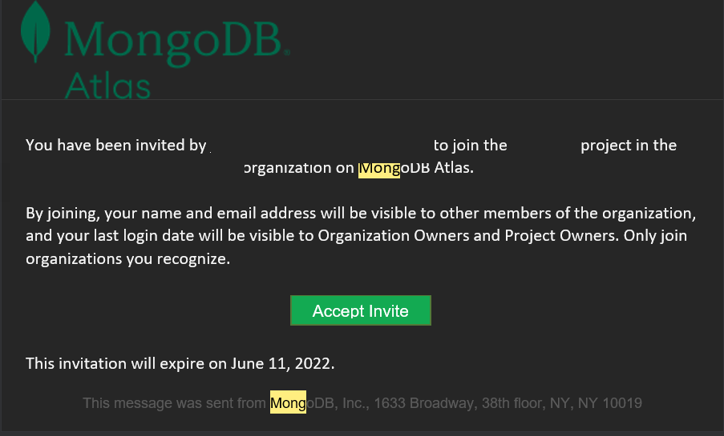

2. On Visual Studio Code, clone the repo onto your device.
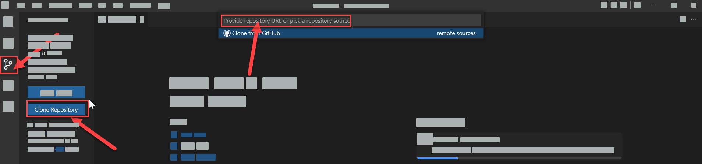

3. Add a new branch by clicking on the 3 dots, then go on branch -> create branch and provide the name in the text box.
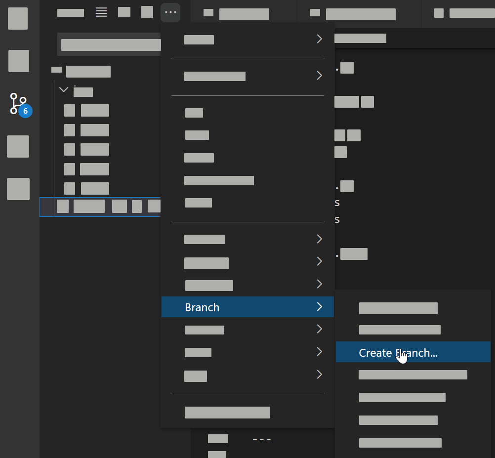

4. Open a new terminal and enter these codes: ```npm install```, ```npm install heroku```, ```npm install nodemon```, repeat this for all npms listed here with  ```npm install <package-name>```:
    - bcrypt
    - body-parser
    - cors
    - ejs
    - express
    - express-session
    - heroku
    - joi
    - mongoose
    - nodemon
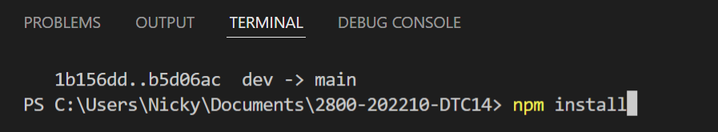
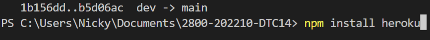
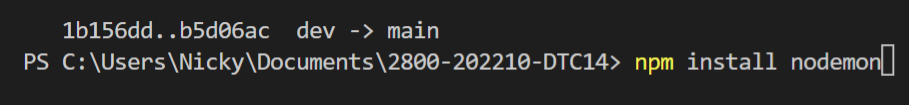

5. To test your edits, enter ```nodemon server.js``` into the terminal.
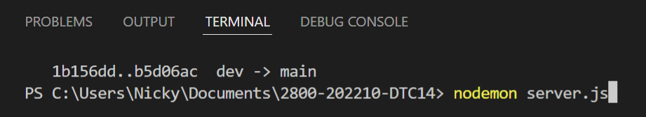

6. Once the tests are working, merge your branch to dev by clicking on the branch, selecting dev, then clicking the 3 dots, then go on branch -> merge branch and select your feature branch
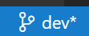
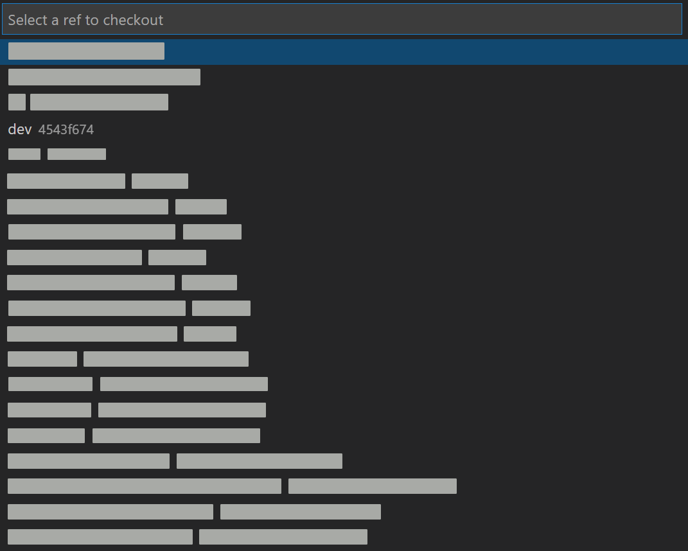
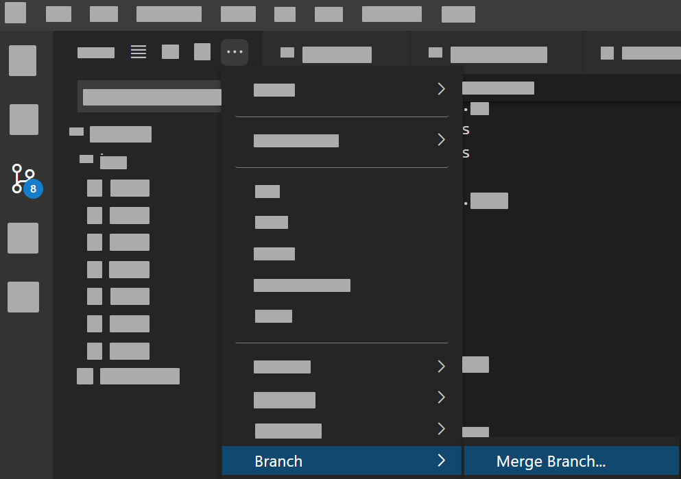
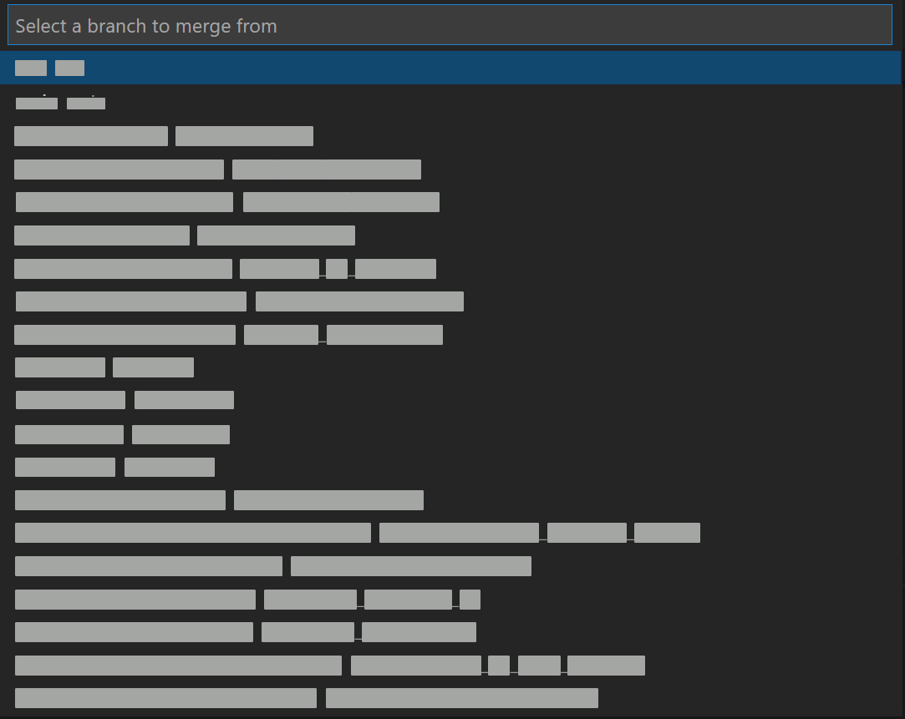


## Features
---

To use the features, go to [co-vention.herokuapp.com](https://co-vention.herokuapp.com) and create a new account in the login page.

#### Game Page

The game page holds the game that we have for our application. The game is controlled by moving the mouse and clicking. Clicking on the screen will fire a projectile outwards from the syringe. The goal of the game is to destroy as many bacteria as possible before they get to the planet. Once they get to the planet, the game is over. Your score is the amount of bacteria destroyed.

#### Quiz Page

The quiz page hold the quiz. The quiz is a multiple choice question quiz that is based on COVID-19 information and safety. One point will be given when the question is correct. At the end, the answers you got wrong a reviewable.

#### Admin Panel

For admins only. The panel allows you access admin data and modify/delete user data. You can also see all scores and all users in the different pages. The dashboard only shows the 6 most recent quiz scores and the 3 most recent game scores. It also allows you to see the 3 most recent accounts.

#### News Page

Fetches the news from News API. The news are filtered for covid specific new using a filter. Clicking a news article leads to a preview of the article which will eventually lead to the real article.

### Credits
---
Code snippets used and found online or from previous assignments
* [Highlighting the current tab](https://www.w3schools.com/howto/howto_js_tabs.asp)
* [Simulating a button pressed effect (The first example, "Add a pressed effect on click")](https://www.w3schools.com/howto/howto_css_animate_buttons.asp)
* [Slideshow](https://www.w3schools.com/howto/howto_js_slideshow.asp)
* [Responsive Web Design](https://www.w3schools.com/css/css_rwd_intro.asp)

## Creators
---
1. [Alexander Liu](https://github.com/A1exander-liU)
2. [Nicky Cheng](https://github.com/RealGoldenGeneral)
3. [Jack Berena](https://github.com/jackberena)
4. [Arghavan Dor](https://github.com/ArghavanDor18)
5. [Jack Luo](https://github.com/LzhJack)
